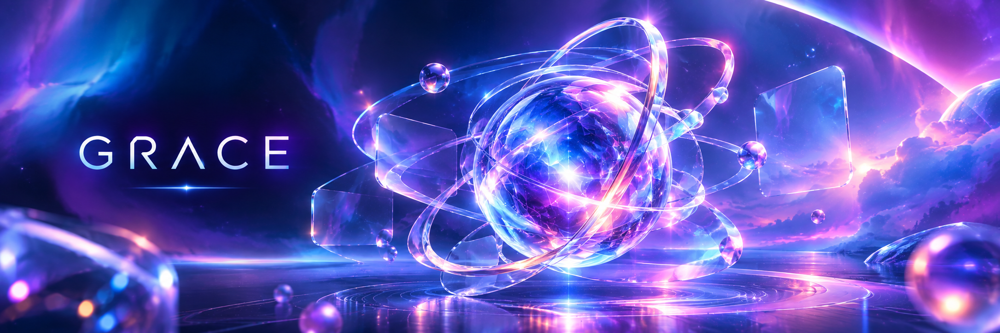

<p align="center">
  
</p>


<!-- ====================================================== -->
<!--          GRACE JUNG | AI & DATA SCIENCE PORTFOLIO      -->
<!--                 BLUE × PINK × GREEN                    -->
<!-- ====================================================== -->

<div align="center">

<!-- FUTURISTIC ANIMATED HEADER -->


<!-- ANIMATED TYPING INTRODUCTION -->


<br/>


<br/><br/>

### LEARN · BUILD · EXPLORE · CREATE

*Exploring the intersection of technology, intelligence, and creativity.*

</div>

---

<!-- ABOUT ME -->

## 👋 About Me

Hi, I'm **Grace Jung** — a Python learner and aspiring AI developer exploring the fascinating world of Data Science, Machine Learning, and Deep Learning.

My journey into programming began with Python, where I discovered how a few lines of code could transform raw data into meaningful insights and intelligent solutions.

Currently, I am developing my programming fundamentals, strengthening my understanding of data analysis, and exploring how machine learning algorithms and neural networks learn from data.

I believe that becoming a developer is not only about writing code. It is also about asking better questions, solving problems creatively, and continuously learning through experimentation.

### 🔍 What Drives Me

- **Curiosity:** Understanding how algorithms learn patterns from data.
- **Creativity:** Exploring new ways to combine AI with real-world ideas.
- **Problem Solving:** Turning complex problems into manageable steps.
- **Growth:** Learning through practice, experimentation, and reflection.

> "Every line of code is a small step toward building something meaningful."

---

## 🧭 My Learning Journey

<div align="center">


</div>

### From Python Fundamentals to Artificial Intelligence

My learning journey follows a progressive path, building a strong foundation before moving toward more advanced AI concepts.

| Stage | Learning Focus | Current Direction |
|---|---|---|
| 01 | Python Programming | Fundamentals, functions, OOP |
| 02 | Data Analysis | Pandas, NumPy, EDA |
| 03 | Machine Learning | Regression, classification, clustering |
| 04 | Deep Learning | Neural networks, CNN, model training |
| 05 | AI Applications | Practical projects and intelligent systems |

<div align="center">

```text
                  MY AI JOURNEY

                 ┌──────────────┐
                 │    PYTHON    │
                 │ Programming  │
                 └──────┬───────┘
                        │
                        ▼
                 ┌──────────────┐
                 │ DATA SCIENCE │
                 │   Analysis   │
                 └──────┬───────┘
                        │
                        ▼
                 ┌──────────────┐
                 │   MACHINE    │
                 │   LEARNING   │
                 └──────┬───────┘
                        │
                        ▼
                 ┌──────────────┐
                 │    DEEP      │
                 │   LEARNING   │
                 └──────┬───────┘
                        │
                        ▼
                 ┌──────────────┐
                 │ AI PROJECTS  │
                 │ Build & Create│
                 └──────────────┘
```

</div>

---

## 🐍 Python Programming

Python is the foundation of my journey into AI and data science.

I am learning how to write clean, readable code and use Python to solve practical problems.

### Topics I'm Exploring

- Variables, data types, operators, and control flow
- Lists, tuples, dictionaries, and sets
- Functions, modules, and exception handling
- Object-Oriented Programming (OOP)
- File handling and data processing
- Working with libraries and virtual environments

### My Approach

Rather than memorizing syntax alone, I practice by writing small programs, debugging errors, and gradually combining concepts into larger projects.

<div align="center">


</div>

---

## 📊 Data Analysis & Data Science

Data analysis is where I begin transforming raw information into useful knowledge.

I am exploring the complete data analysis workflow, from understanding datasets and cleaning missing values to visualizing patterns and preparing data for machine learning.

### Areas of Interest

**Data Collection & Preparation**
- Loading CSV and structured datasets
- Inspecting data types and dimensions
- Handling missing values and duplicates
- Data transformation and feature preparation

**Exploratory Data Analysis (EDA)**
- Descriptive statistics
- Distribution analysis
- Correlation analysis
- Outlier detection
- Data visualization

**Data Processing**
- Encoding categorical variables
- Feature scaling and normalization
- Train-test splitting
- Dimensionality reduction with PCA

### Libraries

<div align="center">


</div>

---

## 🤖 Machine Learning

Machine Learning is one of the key areas I am currently exploring.

I am learning how algorithms identify patterns in data, generate predictions, and evaluate their performance on unseen examples.

### Learning Topics

| Category | Concepts |
|---|---|
| Supervised Learning | Regression, Classification |
| Unsupervised Learning | Clustering, Dimensionality Reduction |
| Model Evaluation | Accuracy, Precision, Recall, F1-score |
| Data Preparation | Scaling, Encoding, Train-test Split |
| Model Improvement | Cross-validation, Hyperparameter Tuning |

### Algorithms I'm Exploring

- Linear Regression
- Logistic Regression
- Decision Trees
- Random Forest
- K-Nearest Neighbors (KNN)
- Support Vector Machines (SVM)
- K-Means Clustering
- Gradient Boosting

### My Machine Learning Workflow

```text
DATA COLLECTION
      ↓
DATA EXPLORATION
      ↓
DATA CLEANING
      ↓
FEATURE ENGINEERING
      ↓
TRAIN / TEST SPLIT
      ↓
MODEL TRAINING
      ↓
MODEL EVALUATION
      ↓
IMPROVEMENT & EXPERIMENTATION
```

My goal is to understand not only how to train a model, but also why a model performs well or poorly and how its results can be interpreted.

<div align="center">


</div>

---

## 🧠 Deep Learning

Deep Learning introduces me to a fascinating way of learning from complex data through artificial neural networks.

I am exploring how neural networks process information, learn representations, and support applications such as image recognition and intelligent prediction.

### Topics I'm Exploring

- Artificial Neural Networks (ANN)
- Neurons, Layers, Weights, and Biases
- Activation Functions
- Forward Propagation
- Backpropagation
- Loss Functions and Optimizers
- Training and Validation
- Convolutional Neural Networks (CNN)
- Recurrent Neural Networks (RNN)

### Deep Learning Concepts

| Concept | Learning Focus |
|---|---|
| Neural Networks | Understanding network architecture |
| Activation Functions | ReLU, Sigmoid, Softmax |
| Loss Functions | Measuring prediction error |
| Optimization | Gradient Descent, Adam |
| CNN | Learning visual features |
| Model Training | Epochs, batches, validation |

### Frameworks

<div align="center">


</div>

---

## 🛠️ My Technology Stack

### Programming & Data

<div align="center">


</div>

### Data Science & Machine Learning

<div align="center">


</div>

### Deep Learning

<div align="center">


</div>

---

## 🚀 Featured Projects

I believe the best way to understand technology is to build something with it.

This section highlights my learning projects, experiments, and practical applications as I progress through Python, Data Science, and AI.

### 🐍 Python Programming

**Python Learning Journey**

A collection of Python exercises, programming fundamentals, and small projects developed while strengthening my coding skills.

Topics include:
- Data structures and functions
- Problem-solving exercises
- File handling and data processing
- Object-oriented programming

[Explore Python Projects](https://github.com/YOUR_USERNAME?tab=repositories)

---

### 📊 Data Analysis

**Exploratory Data Analysis Projects**

Practical experiments using real-world datasets to discover patterns, understand relationships, and communicate insights through visualization.

Topics include:
- Data cleaning and preprocessing
- Statistical summaries
- Correlation heatmaps
- Outlier detection
- Feature scaling and PCA

[Explore Data Projects](https://github.com/YOUR_USERNAME?tab=repositories)

---

### 🤖 Machine Learning

**Predictive Modeling & Classification**

Experiments with supervised and unsupervised learning algorithms, focusing on model training, evaluation, and interpretation.

Topics include:
- Regression and classification
- Decision Tree and Random Forest
- Model performance comparison
- Confusion matrix and F1-score
- Feature importance

[Explore Machine Learning Projects](https://github.com/YOUR_USERNAME?tab=repositories)

---

### 🧠 Deep Learning

**Neural Network Experiments**

A growing collection of experiments exploring neural network architectures and deep learning workflows.

Topics include:
- Neural network fundamentals
- Model training and validation
- Loss and accuracy visualization
- CNN experiments
- Deep learning applications

[Explore Deep Learning Projects](https://github.com/YOUR_USERNAME?tab=repositories)

---

## 📈 GitHub Statistics

<div align="center">


<br/><br/>


</div>

---

## 🎯 My 2026 Learning Goals

My focus is to build a strong foundation in programming and gradually turn theoretical knowledge into practical skills.

### Python & Data Science
- [ ] Strengthen Python fundamentals
- [ ] Practice data structures and algorithms
- [ ] Complete data cleaning and EDA projects
- [ ] Improve data visualization skills

### Machine Learning
- [ ] Understand core ML algorithms
- [ ] Build regression and classification models
- [ ] Practice model evaluation and comparison
- [ ] Explore feature engineering and optimization

### Deep Learning
- [ ] Understand neural network fundamentals
- [ ] Practice forward and backward propagation
- [ ] Build a basic neural network
- [ ] Explore CNN architectures

### Portfolio Development
- [ ] Publish practical projects on GitHub
- [ ] Write clear project documentation
- [ ] Create reproducible notebooks
- [ ] Build an AI-powered application

---

## 🌱 Beyond Coding

Technology is also a creative tool.

Alongside my Python and AI learning journey, I enjoy exploring AI-generated music, cinematic video production, and creative digital experiences.

I am interested in discovering how artificial intelligence can connect analytical thinking with artistic expression.

My long-term ambition is to combine technical knowledge and creativity to build meaningful digital experiences.

---

## 📬 Let's Connect

I'm always interested in learning, experimenting, and sharing ideas about Python, AI, data science, and creative technology.

<div align="center">

<a href="https://github.com/YOUR_USERNAME">

</a>

<a href="mailto:YOUR_EMAIL">

</a>

</div>

<br/>

<div align="center">

### ✨ LEARN AI. BUILD IDEAS. CREATE THE FUTURE.

*One project at a time. One discovery at a time.*


</div>

</div>
